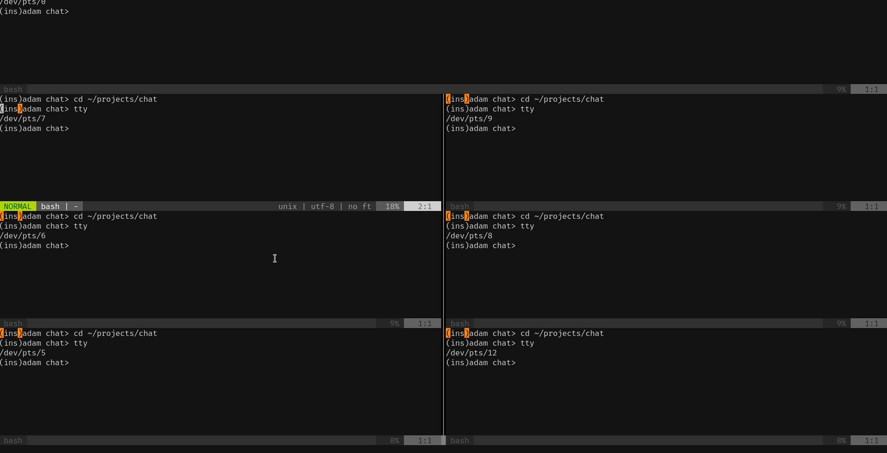

This is a playground for exploring networking issues. I've always been
curious about network programming and peer-to-peer networks, and found
them impenetrable. So this is a very simple POC chat application I'm
creating to explore both of these.

Progress
========

- I've got two programs able to talk to each other over a network
  connection. They are sort-of peers with each other, but they aren't
  equal. One program listens for an incoming connection and the other
  program connects. There are no ways for more people to join: just
  two programs talk to each other.
- I have a server-type program that "hosts" a chat. It takes
  connectiosn from clients, and it receives a message from a client
  and distrubutes them to all clients (including the sending client...
  for now).

TODO
====

I think the following issues will help me see and explore p2p
networking concepts first hand, and why it is different from
client-server models

- If I let many people talk to each other on a p2p architecture, how
  will they actually transmit messages to one another? Will each
  person connect to every other person in a complete graph? Just some?
- If I maintain a conversation history, how will I distribute the
  history?
- How will I order the messages? What does this even mean once I
  consider that some messages could get delayed---perhaps even
  significantly? What if a message claims it came from 3 hours ago? Am
  I going to have to handle re-printing 3 hours worth of messages for
  everyone that could have seen the message? Skip it?

Use
===

1. Start up `server-chat.py`. If you need to pick a different port for
   it, you can pass `-p {port}` to it. This is the port that the
   server will listen for connections on.
2. Start up instances of `client-chat.py`. Make sure to pass the same
   `-p {port}` to them as you did to the server, as this port is the
   port they'll connect to. The client has to connect to the port that
   the server is listening on.
    - If you want to store the conversation history in a file rather
      than having the chat messages display in the same terminal where
      the user types in messages, you can pass in `-o {filename}`.
    - If you want to display the conversation history in different
      terminal window (a different tty), you can pass the filename of
      a tty as an argument. The above image has an example of that.
